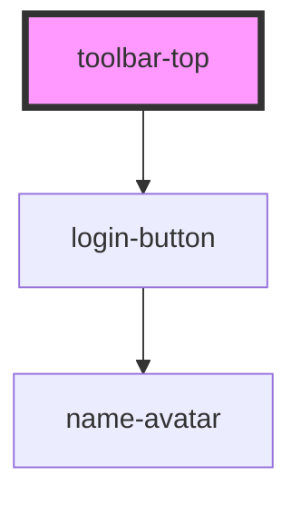

# toolbar-top

<!-- Auto Generated Below -->

## Properties

| Property     | Attribute    | Description | Type               | Default     |
| ------------ | ------------ | ----------- | ------------------ | ----------- |
| `appearance` | `appearance` |             | `string`           | `undefined` |
| `image`      | `image`      |             | `"planet-img.png"` | `undefined` |
| `text`       | `text`       |             | `string`           | `undefined` |

## Dependencies

### Depends on

- [login-button](../login-button)

### Graph

----------------------------------------------

*Built with [StencilJS](https://stenciljs.com/)*
